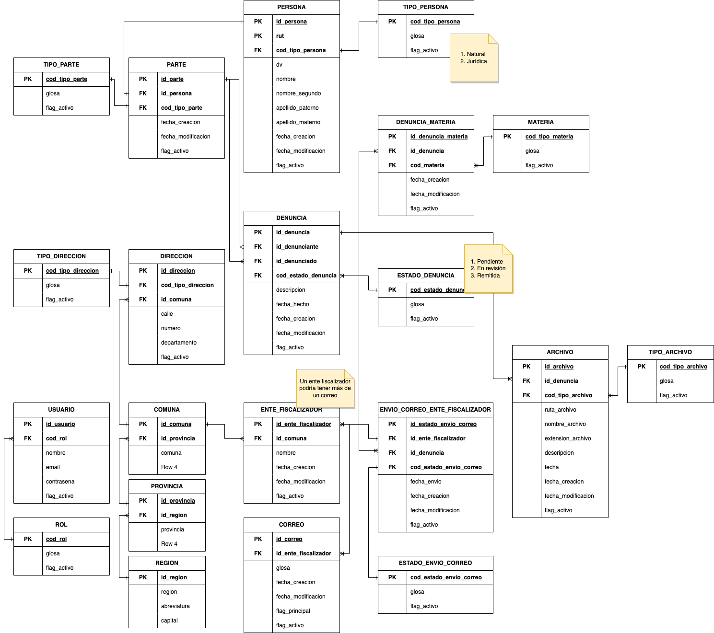

# QuieroDenunciarAPI

 API de denuncias 

## Requerimientos

- python3
- pip3
- python venv
- flask
- flask-sqlalchemy
- marshmallow-sqlalchemy
- mysql-connector
- termcolor

## Infraestructura de prueba

### Requerimientos

- Linux Ubuntu
- docker
- mysql 8.0.30

### Instalación

#### mysql

- Bajar imagen

```bash
docker pull mysql:8.0.30
```

- Crear contenedor

```bash
docker run --name quierodenunciar-mysql -e MYSQL_ROOT_PASSWORD=mypass123 -e TZ=America/Santiago -d -p 3306:3306 mysql:8.0.30
```

- Conectar usando 3306

- Si el contenedor ya está creado, levantar ejecutando

```bash
docker start quierodenunciar-mysql
```

#### phpmyadmin

- Bajar imagen

```bash
docker pull phpmyadmin/phpmyadmin:latest
```

- Crear contenedor

```bash
docker run --name quierodenunciar-phpmyadmin -d --link quierodenunciar-mysql:db -p 8081:80 phpmyadmin/phpmyadmin
```

- Si el contenedor ya está creado, levantar ejecutando

```bash
docker start quierodenunciar-phpmyadmin
```

- Entrar a [phpMyAdmin](http://localhost:8081)
- Usuario: root
- Contraseña: mypass123

### Comandos útiles Docker

- Listar contenedores

```bash
docker ps -a
```

- Entrar via SSH

```bash
docker exec -it <id contenedor> /bin/bash
```

## Desarrollo

### Configuración de ambiente de desarrollo

- Instalar virtualenv usando pip3

```bash
pip3 install virtualenv
```

- Activar módulo de env en Python

```bash
python3 -m virtualenv venv
```

- Activar ambiente

```bash
. venv/bin/activate
```

### Instalación de dependencias

- Instalar dependencias

```bash
pip3 install -r requirements.txt
```

### Configuración de servidor de prueba

- Setear variables de entorno en la CLI, teniendo en cuenta la ubicación del archivo run.py

```bash
export FLASK_APP=src/run.py
export FLASK_ENV=development
```

- Ejecutar en la CLI.

```bash
flask run --host localhost --port 3000
```

- Todo en una línea

```bash
FLASK_APP=src/run.py FLASK_ENV=development flask run --host localhost --port 3000
```

## Comandos útiles PIP

- Instalar y guardar

```bash
pip3 install package && pip freeze > requirements.txt
```

- Guardar package usados

```bash
pip3 freeze > requirements.txt
```

- Instalar packages guardados en requirements.txt

```bash
pip3install -r requirements.txt
```

## Modelo de datos

### Esquema ER

- 


